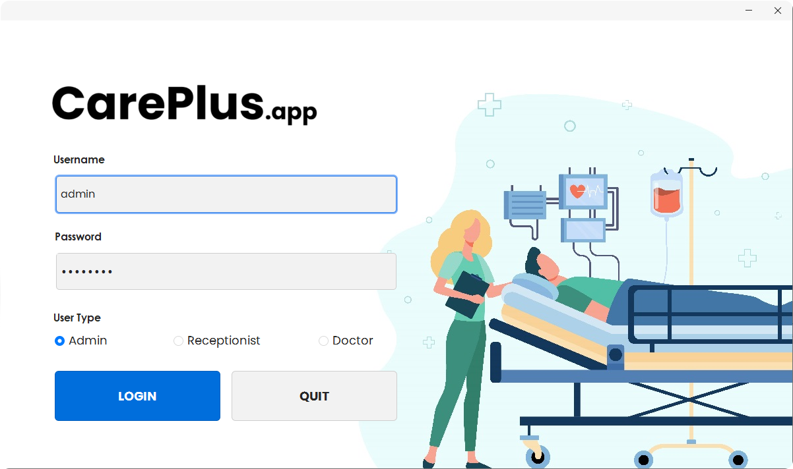
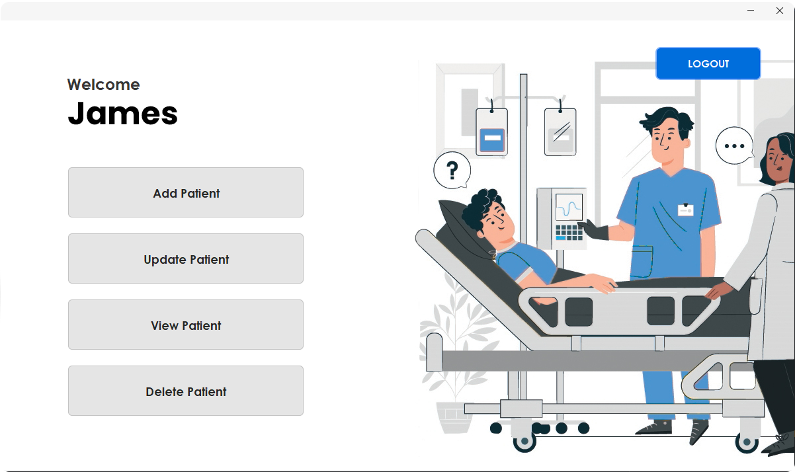
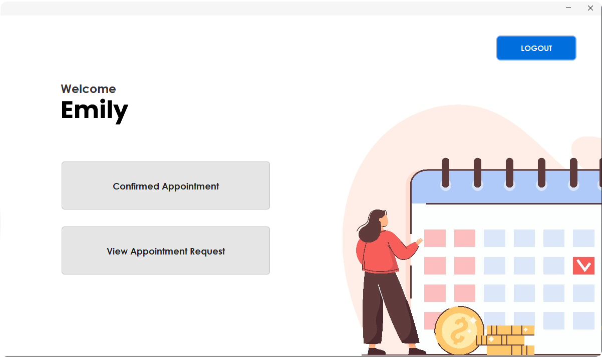
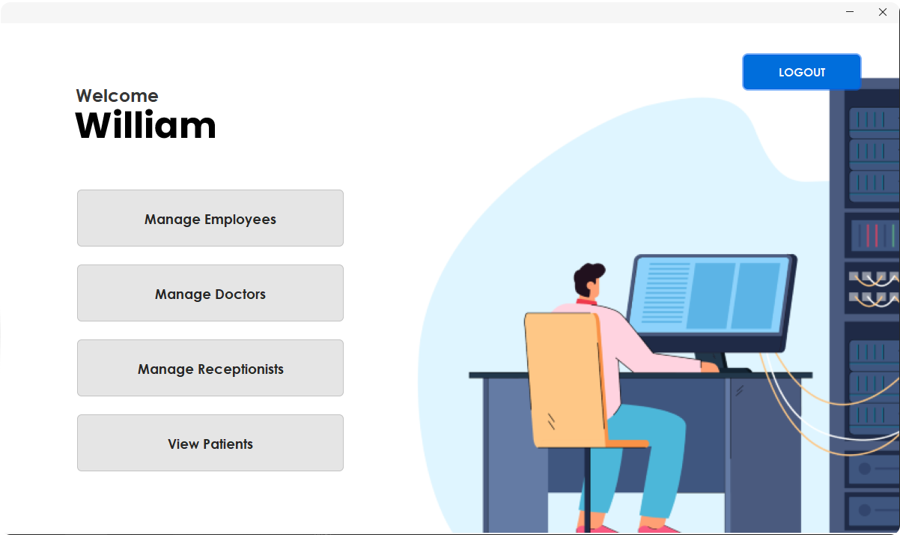
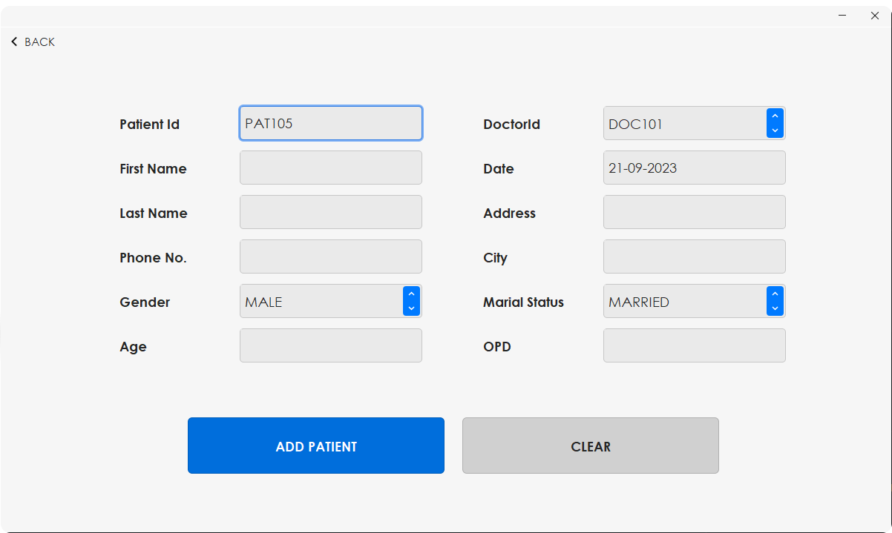
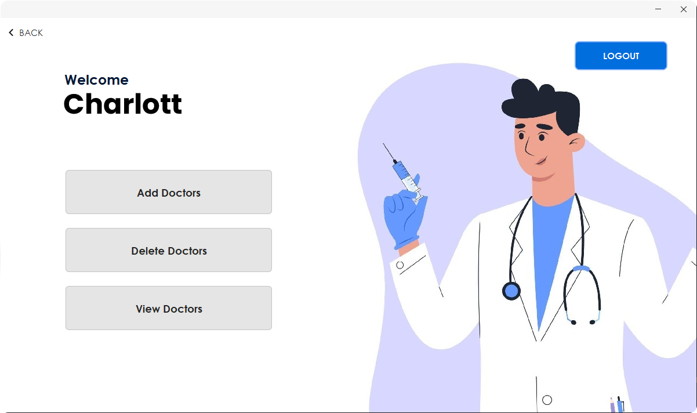

<h1 align="center"> CarePlus 🏥 - Hospital Management App </h1>  

    
   
  Hospital Management Made Easy.

## Table of Contents

- [Introduction](#introduction)
- [Technologies Used](#technologies-used)
- [Database Structure](#database-structure)
- [Password Encryption](#password-encryption)
- [Splash Screen](#splash-screen)
- [Login Module](#login-module)
- [Admin Panel](#admin-panel)
- [Receptionist Panel](#receptionist-panel)
- [Doctor Panel](#doctor-panel)
- [Screenshots](#screenshots)
- [Installation](#installation)
- [Usage](#usage)
- [Contributing](#contributing)

## Introduction 🚀

Welcome to CarePlus, an innovative hospital management application designed to revolutionize healthcare facility operations. CarePlus leverages cutting-edge technology to simplify administrative tasks, enhance patient care, and optimize overall efficiency within hospitals, clinics, and medical institutions.

## Technologies Used 💻

CarePlus relies on the following technologies:

- **Programming Languages and Frameworks:** Developed using Java SE (Java Standard Edition).
- **User Interface (UI) Frameworks:** Java Swing is used to create interactive UIs.
- **Database Management Systems:** Oracle databases are used, with JDBC and SQL for data communication.
- **Security Measures:** Encryption, secure authentication mechanisms, and access controls ensure data security.
- **Integration with External Systems:** For OTP sending, the 2factor API is used, and for SMS sending, the bulksms API is employed.

## Database Structure 📊

CarePlus uses the following database tables for data storage:

1. **Employees Table:** Stores employee information, including ID, name, department, and salary.
2. **Doctors Table:** Contains details of doctors, including ID, name, email contact number, qualification, gender, and specialization.
3. **Receptionists Table:** Stores information about receptionists, including ID, name, and gender.
4. **Patients Table:** Contains patient details, such as ID, name, age, gender, marital status, address, city, mobile number, appointment date, OTP, OPD, doctor ID, and status.
5. **Users Table:** Stores user login information, including login ID, user name, password, and user type.
6. **Appointments Table:** Contains data related to patient appointments, including patient ID, patient name, status, OPD, date and time, doctor name, and mobile number.

## Password Encryption 🔒

In CarePlus, password encryption is implemented using the Base64 algorithm. The encrypted password is securely stored in the database, ensuring protection against unauthorized access.

## Splash Screen 🌊

The splash screen provides visual feedback to users during the app's initialization. It is implemented using multithreading in Java to create a smooth user experience.

## Login Module 🔑

CarePlus offers three login options: Admin, Doctor, and Receptionist. Users are authenticated based on their credentials and directed to their respective modules.

## Admin Panel 👩‍💼👨‍💼

In the Admin Panel, administrators can perform various tasks, including managing employees, doctors, receptionists, and viewing patient details.

## Receptionist Panel 📋

In the Receptionist Panel, receptionists have functionalities for managing patients, including adding, updating, discharging, and viewing patient details.

## Doctor Panel 🩺

In the Doctor Panel, doctors can manage patient appointments, including viewing appointment requests and confirming appointments.

## Screenshots 📸

  
  

  
  
  

## Installation 🛠️

To get started with CarePlus, follow these simple steps:

1. **Install Java Runtime Environment (JRE):** Ensure you have Java Runtime Environment (JRE) installed on your system. You can download the latest version of JRE from the [official Oracle website](https://www.oracle.com/java/technologies/javase-jre8-downloads.html).

2. **Set Up the Database:**
   - Install an Oracle database system if you don't have one already. You can download Oracle Database Express Edition (XE) for free from the [official Oracle website](https://www.oracle.com/database/technologies/xe-downloads.html).
   - Create the necessary tables in your database.

3. **Update Connection Information in Code:**
   - Open the `DBConnection.java` file in your project.
   - Update the database connection details, including the URL, username, and password, to match your Oracle database configuration.

4. **Compile and Run CarePlus:**
   - Compile the CarePlus application using a Java IDE or the command line.
   - Run the application, and you're ready to go!

That's it! You've successfully installed and set up CarePlus for your healthcare facility. Enjoy streamlining your hospital management operations.

## Usage 📖

To start using the CarePlus application, follow these steps:

1. **Update SMS Service API Keys:**
   - CarePlus relies on external SMS services for sending messages. You need to obtain API keys for these services and update them in the application's configuration. Consult the documentation of the SMS service providers to acquire the necessary keys.

2. **Add Admin to Users Table:**
   - Adding admin credentials to the `USERS` table. This step is essential for admin authentication. Insert the admin's login ID, user name, password, and user type as "Admin."

3. **Launch CarePlus:**
   - Compile and run the CarePlus application.
   - On the login screen, use the admin credentials you added to log in as an admin user.

4. **Explore Admin Panel:**
   - Once logged in as an admin, you'll have access to the Admin Panel. From here, you can manage employees, doctors, receptionists, and view patient details.

5. **Continue Setup:**
   - Depending on your use case, you may need to add additional data to other tables in the database, such as doctors and receptionists, before fully utilizing the application.

By following these steps, you'll be ready to utilize CarePlus for efficient hospital management.

## Contributing 🤝

We welcome contributions to improve and expand CarePlus. Whether you're a developer, designer, tester, or just an enthusiastic user, there are several ways you can contribute to the project:

- **Reporting Issues:** If you encounter a bug or have a suggestion for improvement. Be sure to provide detailed information about the issue, including steps to reproduce it.

- **Documentation:** Help improve our documentation by fixing typos, adding missing information, or clarifying existing content. Documentation changes can also be submitted through pull requests.

- **Testing:** Test the application thoroughly and report any issues you discover. Your testing and feedback are valuable for improving the application's stability and functionality.

- **Spread the Word:** Share CarePlus with others in the healthcare industry who may benefit from it. The more users and contributors we have, the better the application becomes.

We encourage open and constructive collaboration to make CarePlus even better.

Thank you for considering contributing to CarePlus!

---
